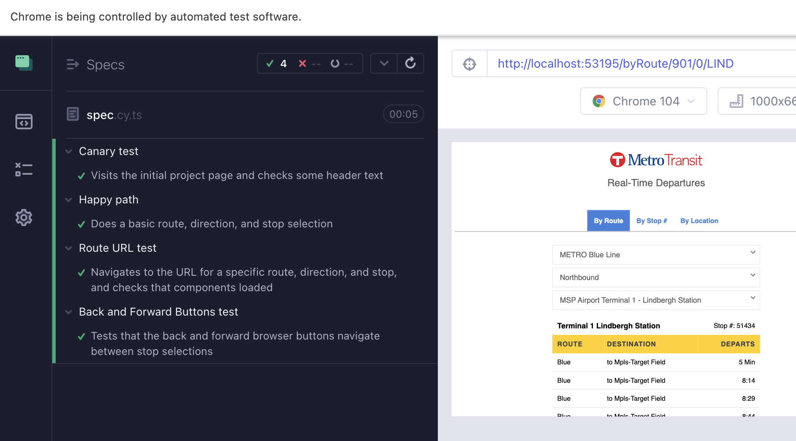

# NextripDemo

This project was generated with [Angular CLI](https://github.com/angular/angular-cli) version 14.1.2.

## Development server

Run `npm run start` for a dev server. Navigate to `http://localhost:4200/`. The application will automatically reload if you change any of the source files.

## Build

Run `npm run build` to build the project. The build artifacts will be stored in the `dist/` directory.

## Testing

### Unit Tests

Run `npm run test` to execute the unit tests via [Karma](https://karma-runner.github.io).

The unit tests ideally are used to catch edge cases, error cases, and everything that is hard to test in integration.

### End-to-end tests

Run `npm run e2e` to execute the end-to-end tests via cypress.

The end-to-end tests test simple paths of functionality to verify that integration is hooked up correctly. For example, there are a couple implemented to test URL handling and handling the browser's back and forward buttons.

## Linting and Code Formatting

To run the linter, run `npm run lint`

## Design Decisions

### Framework Selection

- considerations of Angular vs React vs Vue

### API Integration

- generated api interfaces with script from swagger JSON definition
- added layer of separation via service class

### Departure Time Displays

- Keeping up-to-date with timestamps vs using the time string form the server
- Polling interval

### Error handling

### Application Configuration

## Getting the app "Production Ready"

- business contract/relationship with API team
- testing for all supported devices
- select hosting solution aligned with access/uptime requirements
- fill out tests

## Development Challenges

- wording in API [e.g., "place" vs "stop"]

## Todo

[x] implement unit tests  
[x] implement e2e tests  
[x] add routing handler  
[x] clean up display of selected trip  
[ ] show loading indicator when calling API  
[ ] show error messages on errors thrown  
[ ] add polling of trip to keep departure times updated  
[ ] document design decisions  
[x] update favicon  
[x] generally prettify and make it look more app-like  
[ ] implement 'use current location feature'
